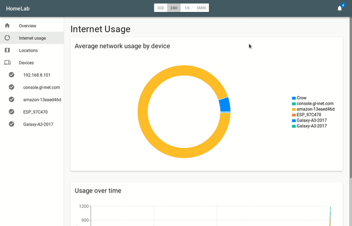

# HomeLab - Smart Home Security

[](http://pypi.python.org/pypi/HomeLab/)
[](http://pypi.python.org/pypi/HomeLab/)
[](http://pypi.python.org/pypi/HomeLab/)

[](http://pypi.python.org/pypi/HomeLab/)

HomeLab enables you to secure and understand the network traffic in your Smart Home.
It visualizes and analyzes the traffic of your network.

## Features
  + Network inspection without a need for dedicated hardware (run it on e.g. RaspberryPi)
  + Visualization of global communication partners
  + Visualization of network share by device

## Setup
If not already available install Nmap on the target system:

Linux:
```
sudo apt-get install nmap
```

Windows:
[https://nmap.org/download.html](https://nmap.org/download.html)

Install python3.x and pip3 and run:

```
sudo pip3 install homelab
```

## Start software
Open a terminal and enter:

Linux:
```
sudo homelab
```

Windows (Admin-Shell):
```
homelab
```

You can open the dashboar by opening:
< device ip that runs homelab>:7464 on your browser
(Currently the dashboard will crash while the initial scans have not been performed. Simply refresh the page in such cases.)

## Roadmap
  - [ ] Login to dashboard
  - [ ] Router port and UPnP inspection
  - [ ] Anomaly detection
  - [ ] HomeLab as Smart Home trigger (e.g. "Dimm the light when smart tv plays Netflix video")
  - [ ] [ < place for your ideas > ](by creating a new issue)
